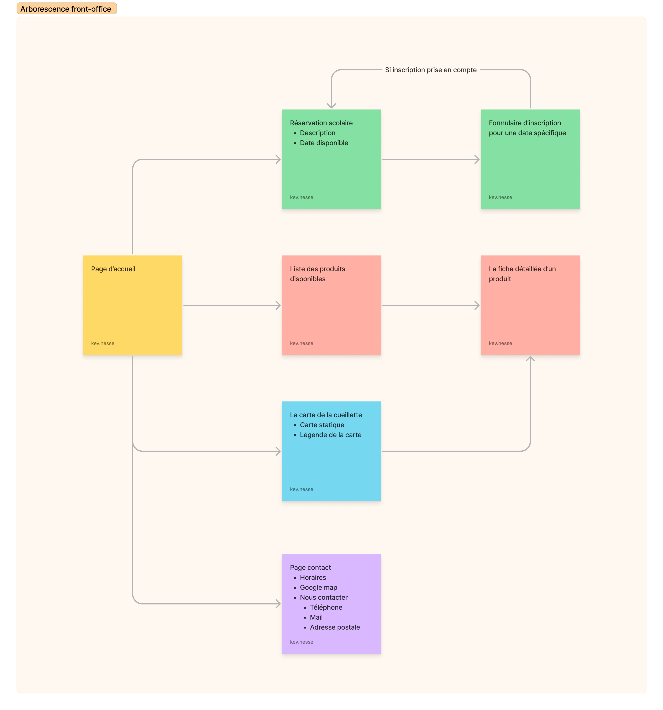
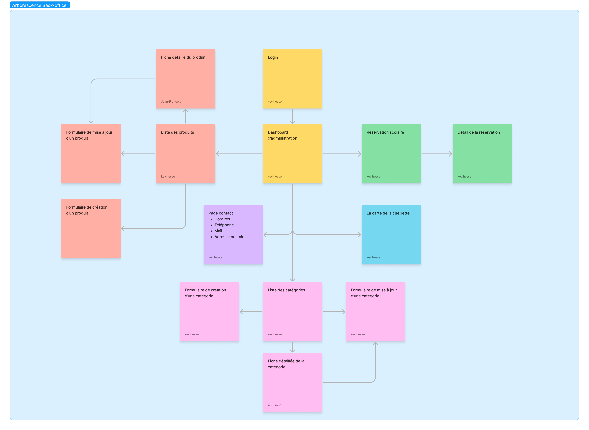
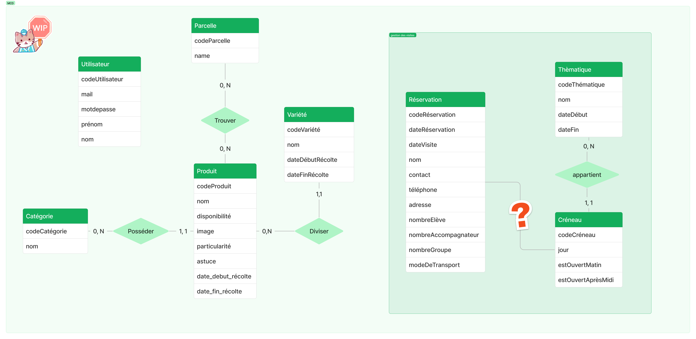

# Cahier des charges

## Présentation du projet 

### La cueillette O'Harvest

O'Harvest est un principe de cueillette où les clients cueillent eux-mêmes les produits (fleurs, fruits et légumes) en fonction des saisons. Il propose des activités pédagogiques à destination des écoles maternelles et primaires...**(à completer)**.  

### Le groupe d'intérêt économique (GIE)

Il s'agit d'un collectif regroupant plusieurs entreprises reliés par un contrat d'intérêt économique. Les frais sont partagés entre eux, mais ont en commun un cahier des charges qui impose certaines contraintes.

## Le besoin

Le client souhaite gagner en autonomie en se détachant du GIE. Il envisage une refonte structurelle et graphique de son site internet.
Il voudrait récupérer les fonctionnalités déjà existantes avec un contrôle avancé sur les données propres à son entreprise. 
Sur le moyen terme, il sera plus libre de développer de nouvelles fonctionnalités sans les contraintes du GIE.

## Objectif

Le projet serait composé

- d'un site vitrine (front-office)
- d'un site d'administration (back-office)
- d'une APIRest.

## Les spécifications fonctionnelles

### MVP (Minimum Viable Product)

- Produits :
  - Disponibilité actuelle et à venir
  - Fiche détaillé
- Back office
  - Gestion des produits
    - Création, modification, suppression
    - Activer / Désactiver la disponibilité d'un produit
  - Gestion des réservations :
    - pré-demande
    - validation / refus
  - Gestion des horaires :
    - configuration classique
    - jours fériés
  - Gestion de la carte : produit sur telle parcelle
- Les horaires d'ouvertures
- Carte google map et position
- Page contact
- Carte de la cueillette statique
- Réservation pour les événements pédagogiques

### Evolutions potentielles

- Carte de la cueillette interactive
- Calendrier des produits / récoltes
- Actualités
- Idées recettes
- Newsletter

## Spécifications techniques

### Technologies

- BDD : PostgresSQL
- APIRest : NodeJs avec le framework Express
- Back-office : EJS
- Front-Office : React

## Public visé

- Ecoles scolaires
- Particuliers

## Navigateurs

Les dernières versions navigateurs mobiles, tablettes et bureaux :

- Firefox
- Chrome
- Safari
- Edge

## Arborescence de l'application

### Front-office

### Back-office

## Liste des routes

### Front-office

| URL                      | Nom                         |
|--------------------------|-----------------------------|
| /                        | Page d'accueil              |
| /produits                | Liste des produits          |
| /produits/:id            | Fiche détaillé d'un produit |
| /carte                   | Carte de la cueillette      |
| /contact                 | Page contact                |
| /reservation             | Page des réservations       |
| /reservation/inscription | Formulaire d'inscription    |

### Back-office

| URL                        | Nom                                    |
|----------------------------|----------------------------------------|
| /login                     | Page de connexion                      |
| /admin                     | Panneau d'administration               |
| /admin/produits            | Liste des produits                     |
| /admin/produits/:id        | Fiche détaillé d'un produit            |
| /admin/produits/:id/edit   | Formulaire de mise à jour d'un produit |
| /admin/carte               | Carte de la cueillette                 |
| /admin/contact             | Page contact                           |
| /admin/reservation         | Page des réservations                  |
| /admin/reservation/:id     | Formulaire d'inscription               |
| /admin/categories          | Liste des catégories                   |
| /admin/categories/:id      | Fiche détaillé d'une catégorie         |
| /admin/categories/:id/edit | Fiche détaillé d'une catégorie         |

### APIRest

| URL                  | Methode | Nom                               |
|----------------------|---------|-----------------------------------|
| /api/products        | GET     | Liste de tous les produits        |
| /api/products/:id    | GET     | Récupération info d'un produits   |
| /api/products        | POST    | Création d'un produit             |
| /api/products/:id    | PUT     | Modification d'un produit         |
| /api/products/:id    | DELETE  | Suppression d'un produit          |
| /api/categories      | GET     | Liste de toutes les catégories    |
| /api/categories/:id  | GET     | Récupération info d'une categorie |
| /api/categories      | POST    | Création d'une catégorie          |
| /api/categories/:id  | PUT     | Modification d'une catégorie      |
| /api/categories/:id  | DELETE  | Suppression d'une catégorie       |
| /api/reservation     | GET     | Liste de toutes les reservations  |
| /api/reservation/:id | GET     | Récupération d'une reservation    |
| /api/reservation     | POST    | Création d'une réservation        |
| /api/reservation/:id | PUT     | Modification d'une réservation    |
| /api/reservation/:id | DELETE  | Suppression d'une réservation     |

## User Stories

| En tant que ... | je voudrais...                                | afin de ...                                       |
|-----------------|-----------------------------------------------|---------------------------------------------------|
| utilisateur     | voir les modalités d'accueil                  |                                                   |
| utilisateur     | voir la liste des produits disponibles        |                                                   |
| utilisateur     | voir la fiche détaillée d'un produit          |                                                   |
| utilisateur     | voir les horaires d'ouverture                 |                                                   |
| utilisateur     | voir l'emplacement (adresse) de la cueillette | s'y rendre                                        |
| utilisateur     | voir le plan de la cueillette                 | trouver l'emplacement des parcelles à cueillir    |
| utilisateur     | trouver le moyen de prendre contact           |                                                   |
| école           | voir les modalités de la visite               | s'organiser                                       |
| école           | s'inscrire à un créneau horaire               | visiter la cueillette                             |
| école           | savoir si ma réservation est confirmée        |                                                   |
| administrateur  | une page de connexion                         | accéder à mon panneau administrateur              |
| administrateur  | me déconnecter                                |                                                   |
| administrateur  | un panneau administrateur                     | effectuer des changements sur le site             |
| administrateur  | afficher la liste des catégories              |                                                   |
| administrateur  | afficher le détail d'une catégorie            |                                                   |
| administrateur  | créer une catégorie                           |                                                   |
| administrateur  | mettre à jour une catégorie                   |                                                   |
| administrateur  | supprimer une catégorie                       |                                                   |
| administrateur  | afficher la liste des produits                |                                                   |
| administrateur  | la fiche détaillée d'un produit               |                                                   |
| administrateur  | créer un produit                              |                                                   |
| administrateur  | mettre à jour d'un produit                    |                                                   |
| administrateur  | supprimer un produit                          |                                                   |
| administrateur  | afficher la carte de la cueillete             |                                                   |
| administrateur  | mettre à jour la carte de la cueillete        | afficher ou supprimer les produits d'une parcelle |
| administrateur  | afficher la liste des contacts                |                                                   |
| administrateur  | mettre à jour la page de contact              |                                                   |
| administrateur  | afficher la liste des réservations            |                                                   |
| administrateur  | mettre à jour une réservation                 |                                                   |
| administrateur  | voir le détail d'une réservation              |                                                   |
| administrateur  | valider une réservation                       |                                                   |
| administrateur  | annuler une réservation                       |                                                   |

## Role

- Product Owner : Kévin HESSE
- Scrum Master : Andréa VIGNARD
- Lead dev front : Jean-François OBERLE-JAECK
- Lead dev back : Guillaume FELICITE
- Git master : Mickael MAGNIN

## Base de données

### MCD

### MLD

- Parcelle(codeParcelle, nom)
- Utilisateur (codeUtilisateur, prénom, nom, mail, motdepasse )
- Variété (codeVariété, nom, dateDébutRécolte, dateFinRécolte, #codeProduit)
- Produit (codeProduit, nom, disponibilité, image, particularité, astuce, dateDébutRécolte, dateFinRécolte, #codeCatégorie)
- Catégorie (codeCatégorie, nom)
- Trouver(#codeProduit, #codeParcelle)

- Thématique (codeThématique, nom, dateDebut, dateFin)
- Créneau (codeCréneau, jour, estOuvertMatin, estOuvertApresMidi, #codeThématique)
- Réservation (codeRéservation, dateRéservation, dateVisite, nom, contact, téléphone, adresse, nombreEleve, nombreAccompagnateur, nombre groupe, modeDeTransport)

### Dictionnaire de données

Table Produit

| Champs           | Type                    | Spécificités            | Description                                 |
|------------------|-------------------------|-------------------------|---------------------------------------------|
| codeProduit      | int                     | Primary Key, Not null   | L'identifiant du produit                    |
| nom              | text                    | Not null                | Le nom du produit                           |
| disponibilité    | boolean                 | Not null, Default false |                                             |
| image            | text                    |                         | Le lien de l'image du produit               |
| particularité    | text                    |                         | Description du produit                      |
| astuce           | text                    |                         | Astuce sur le produit                       |
| dateDébutRécolte | datetime with time zone | Not Null                | Date globale du début de récolte du produit |
| dateFinRécolte   | datetime with time zone | Not Null                | Date globale de fin de récolte du produit   |

Table Categorie

| Champs        | Type | Spécificités          | Description                       |
|---------------|------|-----------------------|-----------------------------------|
| codeCategorie | int  | Primary Key, Not Null | l'identifiant de la categorie     |
| nom           | text | Not Null              | le nom de la categorie de produit |

Table Variété

| Champs           | Type                    | Spécificités          | Description                     |
|------------------|-------------------------|-----------------------|---------------------------------|
| codeVariete      | int                     | Primary Key, Not Null | l'identifiant de la variété     |
| nom              | text                    | Not Null              | le nom de la variété            |
| dateDébutRécolte | datetime with time zone | Not Null              | la date du debut de la recolte  |
| dateFinRécolte   | datetime with time zone | Not Null              | la date de la fin de la recolte |

Table Parcelle

| Champs       | Type | Spécificités          | Description                  |
|--------------|------|-----------------------|------------------------------|
| codeParcelle | int  | Primary Key, Not null | L'identifiant de la parcelle |
| nom          | text | Not null              | Le nom de la parcelle        |

Table Utilisateur

| Champs          | Type | Spécificités          | Description                      |
|-----------------|------|-----------------------|----------------------------------|
| codeUtilisateur | int  | Primary Key, Not null | L'identifiant de l'utilisateur   |
| mail            | text | Not null              | Le mail de l'utilisateur         |
| motDePasse      | text | Not null              | Le mot de passe de l'utilisateur |
| nom             | text | Not null              | Le nom de l'utilisateur          |
| prenom          | text | Not null              | Le prénom de l'utilisateur       |

Table Reservation

| Champs               | Type                     | Spécificités          | Description                                |
|----------------------|--------------------------|-----------------------|--------------------------------------------|
| codeRéservation      | int                      | Primary Key, Not null | L'identifiant de l'utilisateur             |
| dateDeRéservation    | datetime with time zone, | Value >= date now()   | La date de prise de rendez-vous            |
| dateVisite           | datetime with time zone  | Value >= date now()   | La date de la visite                       |
| nom                  | text                     | Not null              | Le nom de l'école                          |
| contact              | text                     | Not null              | La personne à contacter au sein de l'école |
| adresse              | text                     | Not null              | L'adresse de l'école                       |
| nombreEleve          | int                      | Not null, Value > 0   | Le nombre d'élève                          |
| nombreAccompagnateur | int                      | Not null, Value > 0   | Le nombre d'accompagnateur                 |
| nombre groupe        | int                      | Not null, Value > 0   | Le nombre de groupe                        |
| modeDeTransport      | text                     |                       | Le mode de transport de l'école            |

Table Creneau

| Champs             | Type    | Spécificités            | Description                    |
|--------------------|---------|-------------------------|--------------------------------|
| codeCréneau        | int     | Primary Key, Not null   | L'identifiant de l'utilisateur |
| jour               | text    | Not Null                | jour avec date du creaneau     |
| estOuvertMatin     | booleen | Not Null, default false | ouverture le matin             |
| estOuvertAprèsMidi | booleen | Not Null, default false | ouverture l'aprem              |

Table Thematique

| Champs         | Type                    | Spécificités                  | Description                  |
|----------------|-------------------------|-------------------------------|------------------------------|
| codeThematique | int                     | Primary Key, Not null         | L'identifiant du théme       |
| nom            | text                    | Not null                      | Le nom du théme de la visite |
| dateDebut      | datetime with time zone | Not null                      | La date de début du théme    |
| dateFin        | datetime with time zone | Not null, dateFin > dateDebut | La date de fin du théme      |
